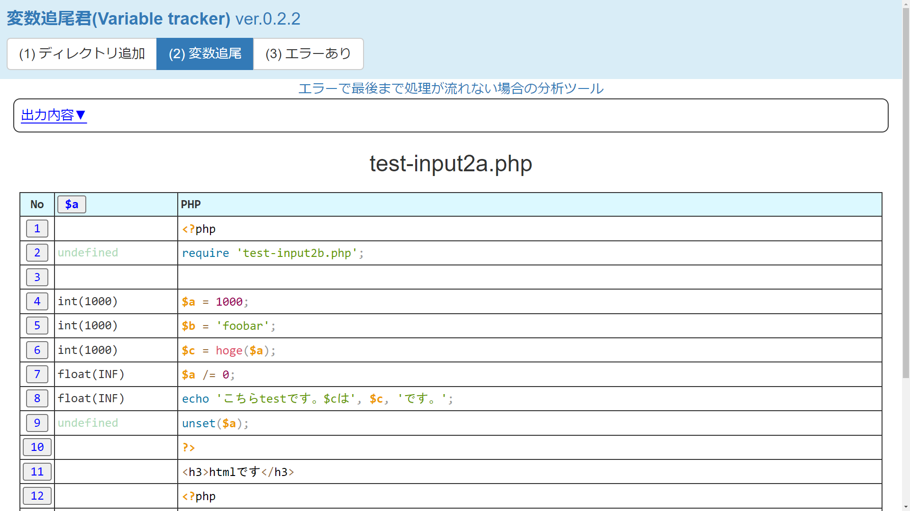

# 変数追尾君(Variable Tracker)
 In PHP file, this debug tool discloses the value of all variables at the scopoe.
 
[公開サイト(http://yanasehiroki.php.xdomain.jp/var_tracker/why.php)](http://yanasehiroki.php.xdomain.jp/var_tracker/why.php)

<h3>制作の背景</h3> 

プログラミングにデバッグはつきものです。 
しかし、困ったことにエラーメッセージがいつも的を得ているとは限りません。
 

通常、このような場面ではvar_dump()関数が多用されます。 
あやしい変数を見つけて、その値に変化がありそうなところにvar_dump()関数を埋め込む。。
 

この作業を簡単にするためのデバッグツールが「変数追尾君」です。
 

<h3>使い方(How to use)</h3> 

[(1) ディレクトリ追加] 画面からPHPファイルがある<b>ディレクトリ</b>（フォルダー）を選択してアップロードしてください。

画面下に表示されるファイル一覧から<b>変数を確認したいファイル</b>を１つ選択してください。

[(2) 変数追尾] 画面が表示されます。上部の<b>出力内容</b>をクリックするとコードの実行結果が表示されます。

<b>行番号</b>をクリックすると、その行のスコープで参照できる変数の値が一覧表示されます。

再度、<b>行番号</b>をクリックすると一覧が閉じます。

(このツールでは行末にセミコロンがある場所で変数の値を取得しています)

変数の一覧で<b>変数名</b>をクリックすると、各行におけるその変数の値が１列で表示されます。

再度、<b>変数名</b>をクリックすると選択が解除されます。

エラーがあり [(2) 変数追尾] が正常に表示されない場合、[(3) エラーあり] を開きます。

PHPの行と、出力内容（echo文など）が一緒に表示されます。

<b>PHPの行</b>をクリックすると、その行における変数の値が表形式で表示されます。

再度、<b>PHPの行</b>をクリックすると表が非表示になります。

